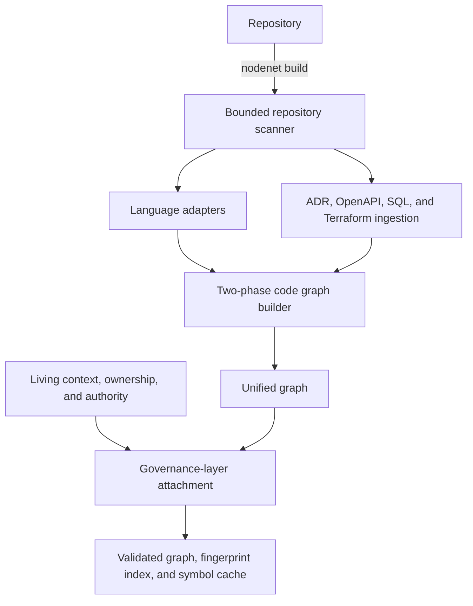

# NodeNet Architecture

NodeNet represents a repository as one coherent graph made of several layers
(spec §3): **code**, **living context**, **ownership**, **authority**, and an
ephemeral **change** layer. The layers are merged into a single queryable graph,
never physically separated.

## Data flow

The two-phase graph builder creates all nodes before edges, so forward
references across files are retained. Governance attachment then adds context
and actor nodes plus `governed_by`, `applies_to`, `owned_by`, and `approved_by`
relationships before persistence.

Analysis commands (`impact`, `reviewers`, `health`, `query`, ...) load the stored
graph (runtime-validated), rebuild the light index from it, and reload living
context + ownership from disk.

## Module map

| Module | Responsibility |
| --- | --- |
| `src/types/` | Branded identifiers, typed `Result<T, E>`, domain errors |
| `src/graph/` | Discriminated node union, typed edges with relation rules, immutable `Graph` + `GraphPatch`, cycle-safe traversal |
| `src/security/` | `SafeRelativePath`, resource limits, secret detection |
| `src/config/` | Valibot-validated `nodenet.config.json` |
| `src/scanner/` | Iterative repo walk, ignore patterns, symlink defense |
| `src/parser/` | Tiered language adapters, parser registry, parse cache, and normalized symbols/imports/references |
| `src/analyzer/` | Code-graph construction, governance attachment, and deterministic ADR/OpenAPI/SQL/Terraform ingestion |
| `src/context/` | Canonical LCDD 0.6 Registry adapter, legacy migration, lifecycle and provenance |
| `src/ownership/` | Source-ranked ownership resolution, CODEOWNERS, git-history suggestions |
| `src/authority/` | Authority levels + LCDD governance classification mapping |
| `src/change/` | Git diff (arg arrays only), unified-diff parsing, symbol-level diff, impact |
| `src/integration/` | Reversible query-first guidance installers for Codex, Claude, Cursor, and Agent Skills |
| `src/review/` | Severity derivation, reviewer resolution with dedup |
| `src/health/` | Metrics derived strictly from graph state |
| `src/ai/` | Minimum Sufficient Context bundle builder |
| `src/storage/` | `.nodenet/` persistence, fingerprint index, symbol cache, audit log |
| `src/visualization/` | Self-contained governance map: community layout, semantic shapes, authority rings, change-decision overlay, evidence inspector |
| `src/github/` | GitHub REST client (global fetch), PR comment builder, PR integration (`github pr`) |
| `src/mcp/` | MCP stdio plus experimental HTTP controls: scoped access, rate limits, immutable snapshots, cancellable workers, output security/contracts |
| `src/governance/` | Stable governance decisions, audit events, quality gates, and emergency overrides |
| `src/identity/` | Actor identity, role bindings, repository/context scope, and signed override verification |
| `src/evaluation/` | Historical GitHub import, isolated replay, blind labeling, and decision-quality reports |
| `src/onboarding/` | Safe bootstrap and repository-readiness checks |
| `src/cli/` | All commands (spec §54) |

## Key design decisions

1. **Two-phase graph build.** All nodes are created before any edge. Forward
   references across files therefore always resolve; there are no dropped edges.
2. **Deterministic, type-checker-free analysis.** Each file is parsed
   independently; cross-file resolution uses an explicit import/export table.
   No type checker, no network, no non-determinism. Trade-offs are documented in
   `docs/adr/001-parser.md`.
3. **Declared governance > inference.** Ownership resolution is ranked:
   LCDD context > NodeNet explicit > CODEOWNERS > git history. Git history can
   only produce *suggestions* (spec §10, §57).
4. **Graphs are immutable snapshots + change sets.** Mutations report
   `GraphPatch` so builds are auditable and testable (spec §37).
5. **Everything from the repository is untrusted.** Runtime validation
   (Valibot) at every external boundary; resource limits fail safely.
6. **One package.** NodeNet is a single package until real boundaries justify
   splitting (`@nodenet/core`, `@nodenet/github`, ...) — spec §67.
7. **Local HTTP is an explicit experimental boundary.** The HTTP bridge is not
   MCP Streamable HTTP. It defaults to loopback and adds scoped authorization,
   rate limiting, atomic snapshot reload, cancellable execution, and bounded
   output around the same deterministic tool handlers used by stdio.

## Consistency guarantees

- Edge endpoints always exist (added in dependency order / two-phase build).
- Edge relation validity is enforced at construction via
  `RELATION_RULES` and re-validated when loading persisted snapshots.
- Lifecycle transitions are validated; forced transitions are audited.
- Health metrics are computed from the actual graph — nothing is fabricated.

## Related docs

- [README.md](README.md) — overview, install, CLI reference
- [docs/](docs/) — documentation index (concepts, ADRs, threat model)
- [CONTRIBUTING.md](CONTRIBUTING.md) — how to change the code that implements
  this architecture
