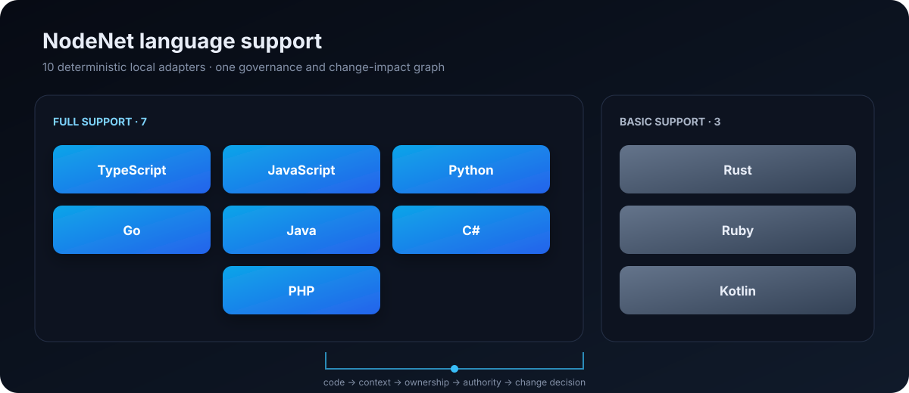
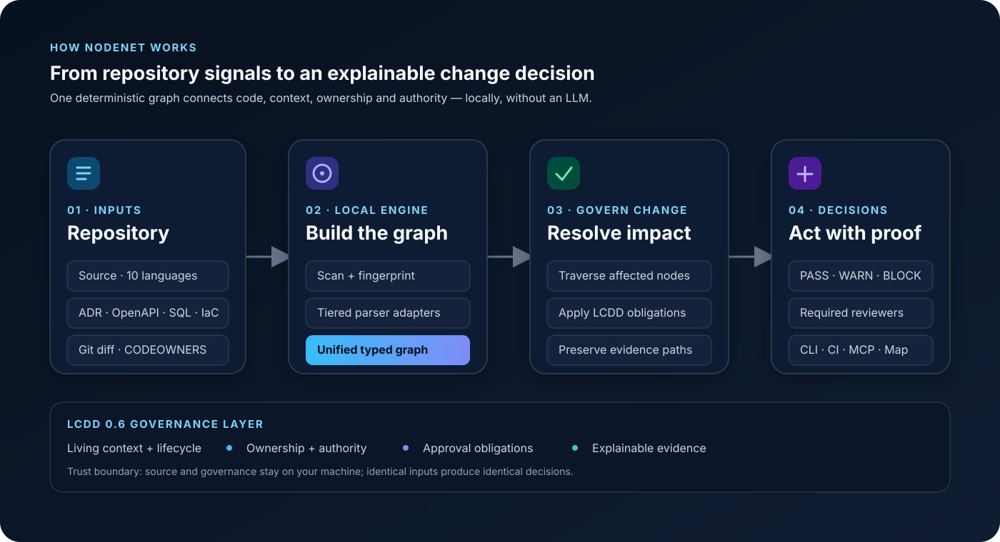

<p align="center">
  
</p>

<p align="center">
  <strong>Governance-aware repository intelligence for AI agents.</strong>
</p>

<p align="center">
  
</p>

<p align="center">
  <a href="https://www.npmjs.com/package/@antihero/nodenet"></a>
  <a href="https://www.npmjs.com/package/@antihero/nodenet"></a>
  <a href="LICENSE"></a>
  <a href="package.json">= 20" /></a>
  <a href="tsconfig.json"></a>
  <a href="https://github.com/Lelianto/nodenet/actions"></a>
  <a href="https://github.com/Lelianto/nodenet"></a>
</p>

AI coding agents can search code. They do not automatically know which rules
govern a change, who owns it, what its blast radius is, or when human approval
is mandatory. Software is more than code —
architecture decisions, business rules, ownership boundaries, security
policies, and team responsibilities determine whether a change should be made
and who should review it.

**NodeNet connects code structure, living context, ownership, authority, and
the actual Git change so an AI agent can route work, respect constraints, and
request the right review before changing code.** It is deterministic,
local-first, and requires no LLM or vector store for core analysis. Network
access is reserved for explicit integrations such as GitHub.

It is the practical reference implementation of **Living Context Driven
Development (LCDD)** — context treated as a living, versioned, governed
artifact ([living-context-driven-development](https://github.com/Lelianto/living-context-driven-development)).

---

## Contents

- [What it does](#what-it-does)
- [The problem it solves](#the-problem-it-solves)
- [How it works](#how-it-works)
- [See it in action](#see-it-in-action)
- [Why NodeNet (vs Graphify & co)](#why-nodenet-vs-graphify--co)
- [Measured evidence](#measured-evidence)
- [Requirements](#requirements)
- [Install](#install)
- [Quick start](#quick-start)
- [CLI reference](#cli-reference)
- [How governance is declared](#how-governance-is-declared)
- [Configuration](#configuration)
- [GitHub pull-request integration](#github-pull-request-integration)
- [AI assistant integration (MCP)](#ai-assistant-integration-mcp)
- [Team setup](#team-setup)
- [Example project](#example-project)
- [Security & privacy](#security--privacy)
- [Documentation](#documentation)
- [Testing](#testing)
- [Roadmap](#roadmap)
- [Troubleshooting & FAQ](#troubleshooting--faq)
- [License](#license)

---

## What it does

| Capability | What you get |
| --- | --- |
| **Explainable code graph** | Typed nodes + edges with provenance — every connection says *why* it exists |
| **Bounded repository intelligence** | Lean file-ranked `ask`, hypothetical `affected`, and progressive `route` → `map` → `evidence` → `source` context keep governed retrieval scoped |
| **Living context** | Rules (business, security, compliance) as versioned artifacts with a lifecycle and freshness decay |
| **Ownership & authority** | Who owns code, who approves changes, ranked from LCDD > NodeNet > CODEOWNERS > git history |
| **Change impact** | A git diff becomes a symbol-level report: severity, affected code, ownership boundaries |
| **Review governance** | Deterministic reviewers: `suggested` / `required` / `authorityRequired`, deduplicated, with reasons |
| **AI context bundles (MSC)** | Minimum Sufficient Context for AI agents, secret-scanned, provenance-marked |
| **MCP server** | The whole graph as MCP tools for Claude Code, Codex, and any MCP client |
| **GitHub PR integration** | Post the impact comment and request reviewers on a PR |
| **Interactive visualization** | Force-directed `graph.html` with communities, search, and filters — plus static SVG export |
| **Local-first & deterministic** | Core analysis uses no LLM, vector store, network, or repository-code execution; identical input produces identical output |

Latest reproducible evidence: [medium-repository feature verification and live
A/B](docs/experiments/nodenet-ab-medium-feature-verification-2026-08-09.md),
[self-repository E2E dogfooding](docs/e2e-self-benchmark-2026-08-09.md), and
the [governed-change A/B protocol](docs/experiments/governed-change-ab-protocol.md).

NodeNet has three product outcomes: **Route** to the smallest relevant change
surface, **Govern** with applicable constraints and authority, and **Verify**
the real diff for impact and reviewers. Token efficiency is a constraint, not
the primary promise: required governance is never hidden to make a payload
look smaller.

Media files are indexed as local, non-authoritative retrieval candidates. An
optional bounded `<media-file>.nodenet.json` sidecar may provide a `summary` and
`concepts`; these inferred concepts improve discovery but can never create
governance authority or a blocking decision by themselves.

## The problem it solves

A normal dependency graph can tell you:

> `CheckoutForm → PaymentService`

NodeNet understands:

> `CheckoutForm` **calls** `PaymentService`, which is **owned by** `Payment Team`,
> which is **governed by** `PAYMENT-003`, which requires **approval from**
> `Finance Team`.

So when the Checkout Team changes `CheckoutService`:

- **Impact:** HIGH — the change crosses an ownership boundary.
- **Required review:** `@payment-team`
- **Authority review:** `@finance-team`
- **Why:** `CheckoutService` modifies behavior dependent on `PaymentService`, which is governed by `PAYMENT-003`.

This is the core value: **not just what is connected, but what governs it, who
owns it, and who must review a change.**

## How it works

`nodenet build` runs a deterministic, offline pipeline (see
[ARCHITECTURE.md](ARCHITECTURE.md)):

<p align="center">
  
</p>

Analysis commands (`query`, `related`, `trace`, `impact`, `reviewers`, `health`,
...) load the persisted graph, re-validate it at runtime, and answer from one
unified, explainable model. Only explicitly networked workflows such as GitHub
integration send data off the machine.

## See it in action

Real output from the [example project](examples/payments-demo):

```
$ nodenet owner src/payment/PaymentService.ts
src/payment/PaymentService.ts → payment-team (source: lcdd, confidence: AUTHORITATIVE)

$ nodenet trace runCheckout saveSettlement
runCheckout() @ src/checkout/CheckoutFlow.ts:10
  --calls--> checkout() @ src/checkout/CheckoutService.ts:4
  --calls--> createSettlement() @ src/payment/PaymentService.ts:4
  --calls--> saveSettlement() @ src/payment/SettlementRepository.ts:3

$ nodenet governed-by src/payment/PaymentService.ts
Contexts governing src/payment/PaymentService.ts:
  PAYMENT-003 [ACTIVE] STANDARD — Settlement Processing Rule (approvers: finance-team)
  SEC-009 [ACTIVE] HARDENED — PCI Payment Data Validation (approvers: security-team)

$ nodenet impact --base main
Impact: HIGH
Ownership boundary crossed: checkout-team → payment-team (via PaymentService)
Affected living context: PAYMENT-003 [ACTIVE] STANDARD, SEC-009 [ACTIVE] HARDENED
Review required: payment-team
Authority review: finance-team, security-team

$ nodenet reviewers --base main
Authority approval required:
  finance-team
    because: PAYMENT-003 requires approval from finance-team (STANDARD, status ACTIVE)
  security-team
    because: SEC-009 requires approval from security-team (HARDENED, status ACTIVE)
```

Open the [interactive graph](examples/payments-demo/.nodenet/graph.html) from the
example project to explore the Graphify-style governance map: switch between
Architecture, Governance, and Change views; pan/zoom; inspect evidence paths;
and filter by community, semantic layer, or relationship type.

## Why NodeNet (vs Graphify & co)

Code-graph tools such as [Graphify](https://github.com/Graphify-Labs/graphify)
excel at *understanding* a codebase — mapping code/docs into a queryable graph
for AI assistants. NodeNet does that too, but its focus is the other half of
the job: **governing how code changes**.

| | NodeNet | Graphify & code-graph tools |
| --- | --- | --- |
| Local, deterministic code graph (no LLM, no vector store) | ✅ | ✅ |
| Interactive visualization + communities | ✅ | ✅ |
| AI / MCP integration | ✅ | ✅ |
| **Living context as governed, versioned artifacts** | ✅ | ⚠️ passive extraction only |
| **Ownership ranking (LCDD > NodeNet > CODEOWNERS)** | ✅ | ❌ |
| **Authority levels + lifecycle (DRAFT → ACTIVE → ARCHIVED)** | ✅ | ❌ |
| **Symbol-level change impact + severity** | ✅ | partial (PR dashboard) |
| **Deterministic reviewer resolution with reasons** | ✅ | ❌ (AI triage) |
| **Merge-policy gating on hardened/mandatory rules** | ✅ | ❌ |
| **AI context bundles, secret-scanned** | ✅ | ❌ |
| Multi-language parsing | 10 languages: 7 full + 3 basic | 36+ |
| Markdown/ADR/OpenAPI/SQL/Terraform ingestion | ✅ deterministic | ✅ |

**NodeNet is the governance layer for AI-driven development.** It answers
*"who decides, and what may an AI agent change?"* — not just *"what is
connected?"* It treats rules as living, owned, approved artifacts, and it can
automate review requests and CI gating from that governance. Graphify helps AI
understand code; NodeNet helps teams keep code changeable, safely.

## Measured evidence

The latest medium-repository verification used 1,236 graph nodes, six living
contexts, frozen hidden acceptance tests, and real `cl100k`/`o200k` tokenizer
counts. These are observed results, not universal guarantees:

| Measurement | Observed result |
| --- | ---: |
| Lean `ask` vs full graph result | **130 vs 5,338 tokens** (o200k), identical recommended files |
| Governed `route` context | **157 tokens** (o200k) |
| Progressive evidence | route 157 → map 716 → evidence 842 tokens |
| Deterministic retrieval evaluation | **10/10 gates**, 100% mandatory-context recall |
| Live medium-repo task A/B (n=1) | control ~1,028 vs NodeNet ~1,129 task-input tokens; both acceptance and regression suites passed |
| Retrieval quality in that live task | direct target, zero decoys, plus impact/reviewer evidence |

The honest conclusion is that NodeNet reduces exploration waste and adds
governance evidence. It does **not** yet claim universal end-to-end token
savings or a repository-size break-even threshold. A public task-token claim
is gated on at least ten identical paired tasks, provider telemetry, quality
non-inferiority, 100% mandatory-context/reviewer recall, and a bootstrap 95%
confidence interval. See the [positioning](docs/product-positioning.md) and
[A/B protocol](docs/experiments/governed-change-ab-protocol.md).

## Requirements

| Requirement | Minimum | Check |
| --- | --- | --- |
| Node.js | 20+ | `node --version` |
| git | any | `git --version` (needed for `impact` / `reviewers` / `update`) |

## Install

```bash
npm install -g @antihero/nodenet@beta
```

Or from source:

```bash
git clone https://github.com/Lelianto/nodenet.git
cd nodenet
npm install
npm run build
```

Then run it inside any repository you want to map:

```bash
nodenet init      # creates nodenet.config.json + .nodenet/
nodenet build     # scan, parse, analyze, persist the unified graph
nodenet graph     # interactive visualization (.nodenet/graph.html)
```

## Quick start

```bash
nodenet init             # creates nodenet.config.json + .nodenet/
nodenet build            # scan, parse, analyze, persist the unified graph
nodenet query PaymentService
nodenet ask "what connects checkout to settlement?" --json # lean routing default
nodenet ask "what connects checkout to settlement?" --full --json
nodenet affected PaymentService --depth 2
nodenet trace LoginForm AuthService
nodenet governed-by PaymentService
nodenet owner src/payment/PaymentService.ts
nodenet owner src/payment/PaymentService.ts --explain
nodenet context PaymentService --detail route  # files + owner + governance
nodenet context PaymentService --detail evidence
nodenet context PaymentService --detail source # bounded, secret-scanned snippets
nodenet impact --base main                    # analyze the current change
nodenet reviewers --base main                 # who should review it
nodenet report                                # highlights: god nodes, communities, governance
nodenet health                                # context health report
nodenet health --uncovered                    # list files missing ownership
nodenet snapshot -o .nodenet/snapshot.json   # record graph state for CI
nodenet diff-snapshot .nodenet/snapshot.json # exit 2 when graph drift exists
nodenet graph                                 # interactive HTML visualization
nodenet graph --change --base main            # overlay impact + governance decision
nodenet graph -f svg -o graph.svg             # static SVG image
nodenet changes --base main --refs feature-a feature-b # local multi-branch collision triage
nodenet install --platform codex              # query-first project guidance
nodenet serve --port 7341                     # MCP Streamable HTTP
nodenet serve --token "$TOKEN" --scopes graph:read,context:read
```

Incremental builds reuse unchanged local parse results. Built-in deterministic
adapters cover ten major languages. Every Markdown file (README, guides, ADRs,
RFCs, docs), OpenAPI specs, SQL schemas, and Terraform resources is added to
the same graph without an LLM or paid service. Every relationship is classified as
`EXTRACTED`, `DECLARED`, `INFERRED`, `AMBIGUOUS`, or `OBSERVED`.

| Support | Languages | Extraction contract |
|---|---|---|
| Full | TypeScript, JavaScript, Python, Go, Java, C#, PHP | declarations, imports/dependencies, visibility/exports, classes and methods, language-specific structural relationships |
| Basic | Rust, Ruby, Kotlin | files, primary declarations, and imports/dependencies |

Run `nodenet languages` or `nodenet languages --json` to inspect the exact
adapter and capability matrix installed in the current NodeNet version.
Full per-language examples and access methods are documented in
[docs/languages.md](docs/languages.md).

Machine-readable output: append `--json` to `build`, `query`, `related`,
`trace`, `context`, `explain`, `owner`, `governed-by`, `impact`, `reviewers`,
`conflicts`, `health`. Run `nodenet --help` or `nodenet <command> --help` for
the full option reference.

## CLI reference

| Command | Description |
| --- | --- |
| `init` | Create `nodenet.config.json` and the `.nodenet/` directory |
| `build` | Scan, parse, analyze and persist the unified graph |
| `update` | Incremental rebuild from changed files (fingerprint-based) |
| `watch` | Rebuild on file changes |
| `query <name>` | Find nodes by name |
| `ask <question>` | Lean intent-aware routing; add `--full` for matches, connections, and ranking evidence |
| `affected <target>` | Hypothetical graph blast radius before a change exists |
| `related <name>` | Show direct neighbors of a node |
| `trace <from> <to>` | Shortest explainable path between two nodes |
| `context [target]` | List contexts or build progressive `route`, `map`, `evidence`, or bounded `source` MSC output; `--compat v1` restores the beta.1 wire shape |
| `feedback --query-id ... --outcome ...` | Record local opt-in retrieval outcomes without changing authority |
| `explain <name>` | A node and every relationship with provenance |
| `owner <path-or-symbol> [--explain]` | Who owns a file or symbol, optionally with the full resolution chain |
| `governed-by <name>` | Living contexts governing a node |
| `impact [--base <ref>]` | Analyze the current change (git diff) for impact |
| `reviewers [--base <ref>]` | Resolve reviewers (suggested / required / authorityRequired) |
| `conflicts` | List conflicting living contexts |
| `health [--uncovered]` | Living context health report, optionally listing files without ownership |
| `report` | Deterministic highlights report: god nodes, surprising connections, communities, governance, suggested questions |
| `snapshot [-o <file>]` | Persist a stable, sorted graph snapshot for CI |
| `diff-snapshot <file>` | Compare the current graph with a snapshot; exit `2` on drift |
| `graph [-o <file>] [-f html\|svg]` | Generate an interactive HTML viewer or static SVG image with communities |
| `open [--change] [--base <ref>]` | Open the interactive graph in one command and hot-reload when repository files change |
| `languages [--json]` | Show the ten-language support tier and capability matrix |
| `changes --base <ref> --refs <refs...>` | Compare local branches for graph, context, and ownership collisions |
| `bootstrap [--github]` | Create starter config, canonical LCDD policy, and optional GitHub workflow without overwriting files |
| `benchmark --dataset <file>` | Measure reviewer precision/recall, false blocks, missed impacts, accuracy, and p50/p95 latency |
| `benchmark-languages` | Execute positive and false-positive contracts across all ten adapters |
| `benchmark-retrieval --dataset <file>` | Execute labeled questions against `ask` and MSC |
| `benchmark-governance --dataset <file>` | Execute impact, reviewers, and decisions against labeled git-base scenarios |
| `eval import-github` | Import historical GitHub PR/review metadata into a private local dataset |
| `eval run` | Replay NodeNet safely against exact historical base/head commits |
| `eval label` | Open the loopback-only blind-labeling Decision Lab |
| `eval report` / `eval gate` | Compare labels with replay decisions and enforce quality thresholds |
| `doctor [--json] [--fix]` | Report readiness and optionally install safe missing starter/workflow files |
| `github pr [options]` | Analyze a PR; update an idempotent Check Run, comment, request reviewers, and audit the decision |
| `mcp` | Run the MCP server over stdio for AI assistants |
| `serve [--host] [--port] [--token] [--scopes] [--rate-capacity] [--rate-refill] [--reload-interval] [--no-reload]` | MCP Streamable HTTP with sessions, scopes, rate limits, and atomic reload |
| `audit-verify [--json]` | Verify the tamper-evident local audit hash chain |
| `install --platform <name>` | Install query-first guidance for Codex, Claude, Cursor, or Agent Skills |

## How governance is declared

Living Context uses the canonical **LCDD 0.6.0 Registry** under
`.lcdd/contexts/**/*.yaml`. NodeNet validates these artifacts with the pinned
`@lcdd/core@0.6.0` SDK and retains the complete canonical object while deriving
the graph view it needs:

```yaml
id: PAYMENT-003
version: 1
title: Settlement Processing Rule
description: Settlement creation must be idempotent and auditable.
source:
  type: documentation
  location: docs/adr/003-settlement.md
authority:
  source: { type: organization, id: finance-team, name: Finance Team }
  level: 3
category: domainRule
applies_to: [src/payment/**]
lifecycle: active
governance:
  classification: hardened-standard
  approval_required: true
  approvers: [finance-team]
effective_date: 2026-08-08T00:00:00.000Z
owner: payment-team
enforcement:
  mode: block
```

The legacy `.nodenet/context.json` format remains readable for compatibility
but emits a deprecation warning. Preview and write a canonical migration with:

```bash
nodenet context --migrate
nodenet context --migrate --write
```

Ownership can come from:

1. **LCDD context metadata** (highest authority)
2. **NodeNet explicit ownership** — `.nodenet/ownership.json` + `nodenet.config.json` overrides
3. **CODEOWNERS**
4. **Git history** — *suggestion only*, never a required reviewer

See [docs/concepts/living-context.md](docs/concepts/living-context.md) for the
lifecycle (`draft → candidate → approved → active → …`) and
[docs/concepts/ownership.md](docs/concepts/ownership.md) for the source ranking.

## Configuration

`nodenet init` writes a starter `nodenet.config.json`. Configuration is **data
only** — never executable code, and it is runtime-validated on every load:

```json
{
  "ignore": ["dist", "build", "coverage", ".next", "out"],
  "limits": {
    "maxFileSizeBytes": 1048576,
    "maxFiles": 10000,
    "maxGraphNodes": 100000,
    "maxGraphEdges": 300000
  },
  "reviewPolicy": { "LOW": "informational", "MEDIUM": "comment", "HIGH": "request", "CRITICAL": "approval" },
  "contextFreshness": { "architecture": "180d", "security": "90d", "businessRule": "180d", "default": "180d" },
  "ownership": {
    "teams": {
      "payment-team": { "name": "Payment Team" },
      "checkout-team": { "name": "Checkout Team" }
    },
    "overrides": []
  },
  "developer": { "handle": "your-gh-handle", "team": "checkout-team" },
  "relationships": [
    {
      "from": "CheckoutApi.submit",
      "to": "SettlementProcessor.settle",
      "relation": "calls",
      "rationale": "POST /payments is implemented by the Python settlement service"
    }
  ]
}
```

Key sections: `ignore`, `limits` (resource limits that fail safely),
`reviewPolicy` (severity → action), `contextFreshness` (decay durations),
`ownership.teams` + `ownership.overrides`, `developer`, `secretPatterns` and
`suppressions`, and `relationships`. Declared relationships model boundaries
that static parsing cannot observe (HTTP, queues, RPC, generated clients, and
cross-language calls). They retain `config` provenance and are never inferred
merely because two files share a governance context. Schema reference:
[src/config/config.ts](src/config/config.ts).

## GitHub pull-request integration

`nodenet github pr` runs inside a GitHub Actions checkout of the PR head and
produces the same deterministic impact + review report, optionally posting it:

```bash
nodenet github pr --repo owner/name --pr 42 --base main \
  --comment --request-reviewers --check --sha "$GITHUB_SHA" --mode warn
```

- `--comment` posts the impact + reviewers comment to the PR.
- `--request-reviewers` requests **declared** reviewers only (required +
  authority-required) — git-history suggestions are never auto-requested.
- `--mode observe|warn|enforce` controls rollout. A blocking hardened/mandatory
  decision exits with code `2` only in `enforce` mode, so the command can be a
  required status check. `--json` emits the stable Governance Decision v1.
- `--check --sha <commit>` creates or updates the named GitHub Check Run,
  includes file annotations, retries transient API failures, and works for
  `pull_request` and `merge_group` workflows.
- Every execution records a source-free event in `.nodenet/audit.jsonl`.
  Time-bounded emergency overrides require the exact decision ID, actor,
  reason, and expiry; see [decision quality](docs/decision-quality.md).
- Auth via `GITHUB_TOKEN` (least privilege: `contents: read`,
  `checks: write`, `pull-requests: write`); `GITHUB_REPOSITORY` / `GITHUB_REF` /
  `GITHUB_BASE_REF` are read automatically in Actions.
- Design: [docs/adr/004-github-integration.md](docs/adr/004-github-integration.md).

## Live graph and historical Decision Lab

Open the governance graph without finding generated files manually:

```bash
nodenet open
nodenet open --change --base main
```

NodeNet starts a loopback-only server, opens the browser, watches source and
governance files, incrementally rebuilds, and sends hot-reload events. Use
`--no-open` for terminal/remote workflows and `--port 7342` for a fixed port.
The viewer defaults to the audit-friendly 2D map and includes a dependency-free
**3D view** toggle. In 3D, drag to rotate, Shift+drag to pan, and scroll to zoom;
use the on-canvas arrow pad to move the camera and its center button to reset
the view. The keyboard arrow keys provide the same navigation, `Shift + Arrow`
moves faster, and `Home` or `0` resets the camera. These shortcuts are disabled
while typing in search. Switch back to 2D whenever labels and evidence paths
are the priority.

Historical evaluation can import GitHub PR metadata, replay exact commits in
isolated temporary worktrees, blind-label results locally, and apply CI quality
thresholds. See [historical decision evaluation](docs/evaluation.md).

## AI assistant integration (MCP)

`nodenet mcp` runs a Model Context Protocol server over stdio, exposing the
graph, living context, ownership, authority, impact and reviewers as tools for
AI coding assistants (Claude Code, Codex, and any MCP client):

```bash
nodenet mcp                       # core retrieval preset
nodenet mcp --tools governance    # governance-focused schemas
nodenet mcp --tools all           # complete tool surface
```

Tools: `ask`, `affected`, `query`, `related`, `trace`, `context` (Minimum Sufficient Context —
secret-scanned), `explain`, `governed_by`, `owner`, `impact`, `reviewers`,
`health`, `graph`. All results are deterministic and provenance-backed.
Design: [docs/adr/005-mcp-server.md](docs/adr/005-mcp-server.md). Deployment and
troubleshooting: [docs/mcp-operations.md](docs/mcp-operations.md).

## Team setup

Canonical governance artifacts and the generated viewer are committed. The
machine graph remains generated and is rebuilt locally or in CI:

```
# commit these
.lcdd/contexts/*.yaml      # canonical LCDD 0.6 Living Context Registry
.nodenet/ownership.json    # authored explicit ownership
nodenet.config.json        # review policy, teams, limits
.nodenet/graph.html        # interactive visualization
```

Recommended workflow:

1. One person runs `nodenet init` + `nodenet build` and commits the authored artifacts and viewer.
2. Everyone pulls and runs `nodenet build` (or `nodenet open`) before `query`/`trace`/`impact`.
3. `nodenet impact --base main` runs in CI on every PR (and `github pr` posts
   the comment and requests reviewers).
4. When rules change, edit `.lcdd/contexts/*.yaml` and commit — the lifecycle
   and audit log keep the change explainable.

The [example project](examples/payments-demo) demonstrates the whole flow.

## Example project

See [examples/payments-demo](examples/payments-demo) — a ready-made checkout →
payment project with living context, ownership, authority and a cross-team PR
scenario. It ships a pre-built interactive
[graph.html](examples/payments-demo/.nodenet/graph.html) and a
[README](examples/payments-demo/README.md):

```bash
npm run build
cd examples/payments-demo
./demo.sh          # build, visualize, query, impact + reviewers
```

## Security & privacy

- The repository is untrusted input. NodeNet never executes repository code.
- Paths are validated (`SafeRelativePath`) and symlink-escapes are rejected.
- Resource limits are configurable and fail safely.
- Secret-like files are never scanned; AI context output is secret-scanned.
- Git is invoked with argument arrays only (no shell concatenation).
- Core analysis is local and has no telemetry. Network access occurs only for
  explicit integrations such as GitHub metadata/import and PR automation.
- Least-privilege GitHub integration requests only the permissions needed for
  the selected operation (`contents: read`, and when enabled `checks: write`
  and/or `pull-requests: write`).

See [SECURITY.md](SECURITY.md) and
[docs/security/threat-model.md](docs/security/threat-model.md).

## Documentation

- [ARCHITECTURE.md](ARCHITECTURE.md) — layering, data flow, design decisions
- [docs/](docs/) — full documentation index
  - [docs/concepts/](docs/concepts/) — graph, living context, ownership, authority, change impact, review governance
  - [docs/adr/](docs/adr/) — architecture decision records (parser, runtime validation, graph storage, GitHub, MCP, visualization)
  - [docs/security/threat-model.md](docs/security/threat-model.md)
- [SECURITY.md](SECURITY.md) — security guarantees and reporting
- [CONTRIBUTING.md](CONTRIBUTING.md) — how to contribute
- [CODE_OF_CONDUCT.md](CODE_OF_CONDUCT.md) — community participation standards
- [CHANGELOG.md](CHANGELOG.md) — release history
- [Decision quality and auditability](docs/decision-quality.md) — eval dataset,
  metrics, decision audit, and bounded overrides
- [Design-partner pilot playbook](docs/design-partner-playbook.md) — staged
  rollout, weekly review, and validation gates
- [Glossary](docs/glossary.md) — plain-language definitions for NodeNet, LCDD,
  evaluation, identity, GitHub enforcement, and override terms
- [Historical evaluation](docs/evaluation.md) — GitHub import, safe replay,
  Decision Lab, metrics, and regression gates
- [Verified overrides](docs/verified-overrides.md) — numeric GitHub identity,
  RBAC scope, and signed override verification
- [Product positioning](docs/product-positioning.md) — supported promise,
  evidence boundaries, and competitive frame
- [Token-efficient defaults](docs/token-efficiency-v2.md) — lean output,
  profiles, accounting, and compatibility
- [Governed-change A/B protocol](docs/experiments/governed-change-ab-protocol.md) —
  paired task design and publishable-claim gates

## Testing

```bash
npm run typecheck
npm test
npm run build
npm pack --dry-run
```

Tests cover the declared extraction contract for all ten supported languages,
React, a monorepo,
the cross-team MVP scenario, CODEOWNERS, circular dependencies, malformed
source, and a malicious repository. Property-based tests cover lifecycle
transitions, traversal termination, glob matching and path safety. CI runs on
Node 20 and 22.

## Roadmap

- **Phase 1 (done):** code graph — `build`, `query`, `trace`, `related`
- **Phase 2 (done):** living context — `governed-by`, `conflicts`, `health`
- **Phase 3 (done):** ownership — `owner`
- **Phase 4 (done):** change impact — `impact` (symbol-level)
- **Phase 5 (done):** review governance — `reviewers`
- **Phase 6 (done):** production GitHub enforcement — idempotent Check Run,
  annotations, retry, merge queue, rollout modes, comments, and review requests
- **Phase 7 (done):** AI integration — MSC output + `mcp` server
- **Phase 8 (done):** richer visualization — interactive force-directed graph with communities (`graph`, `graph -f svg`)
- **Quick win (done):** highlights report — `report` (god nodes, surprising connections, communities, governance)
- **Phase 9 (done):** ten-language parsing — seven full and three basic adapters
- **Phase 10 (done):** decision benchmark, audit events, expiring overrides,
  readiness doctor, bootstrap wizard, and design-partner pilot kit
- **Phase 11 (done):** intent-aware retrieval, hypothetical affected analysis,
  progressive source evidence, safe cache/feedback, executable benchmarks,
  and MCP Streamable HTTP
- **Validation-gated:** organization installation, multi-repository governance,
  centralized Contexts, identity mapping, audit/history UI, and billing

The full prioritized development plan (gap audit, three rounds, recommended
order) lives in [docs/roadmap.md](docs/roadmap.md).

## Troubleshooting & FAQ

**`nodenet: command not found`**
The bin directory isn't on your `PATH`. With npm global installs on macOS,
ensure `$(npm config get prefix)/bin` is in your `PATH`, then open a new
terminal.

**`impact` says "Not inside a git repository"**
`impact`/`reviewers` need a git checkout and a base ref. Run `nodenet impact --base main`
inside the repo, or use `nodenet build` + `nodenet query` which don't need git.

**The graph.html canvas looks empty**
Hard-reload (Cmd/Ctrl+Shift+R). Node labels only render when zoomed in enough
(`scale > 0.45`) — scroll to zoom. If it still renders nothing, open it in a
current Chrome/Firefox.

**Why is the package name `@antihero/nodenet`?**
The unscoped name `nodenet` is blocked on npm as too similar to an existing
package. The CLI command is still `nodenet`.

**How do I change a hardened context?**
You can't silently. Run `nodenet context propose <id>` to record a Context
Change Proposal; it never modifies the active context and requires human
review and approval.

**What if my repo is not TypeScript?**
Run `nodenet languages`. NodeNet supports TypeScript, JavaScript, Python, Go,
Java, C#, PHP, Rust, Ruby, and Kotlin. Governance at file level also works for
unparsed repository artifacts; see [language support](docs/languages.md) for
the exact full/basic contract.

## License

[Apache-2.0](LICENSE)
